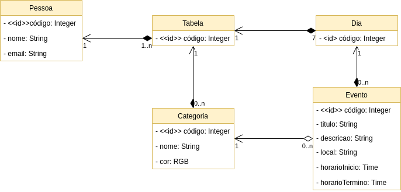

# trabalhoDAW
Trabalho da disciplina de Desenvolvimento de Aplicações Web

## Membros do Grupo
- Gabrieli Barbosa Faria
- Gabriel Portela Macedo Souza
- Roberto Oliveira Cruz Filho

## Trabalho

- Nome: Gestão de Tempo

- Objetivo: Gerenciamento e organização de tempo

- Público-alvo: Estudantes e público geral o quais nescessitam de organizar e formular melhor o seu tempo

- Mercado: Público geral

- Descrição: O sistema precisa armazenar o nome e e-mail do usuário que o utiliza. Cada usuário pode ter várias tabelas diferentes. Cada tabela possui 7 dias em que são armazenados diversos eventos, estes possuem informações tais como título, descrição, local, horário de início e horário de término. Os eventos podem ser classificados por tabela em diversas categorias em que é possível definir a cor em que eles serão mostrados. Cada categoria pode também ser nomeada.

### Diagrama de Classes

